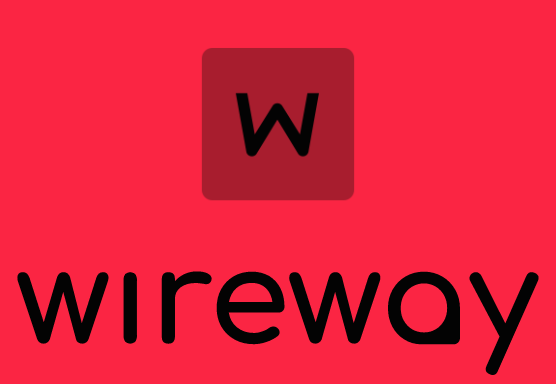

# __WireWay software__

This is a set of three programs for remote connection to computers. Users can either connect to and manage other computers or provide access to their own.

## __Reason for creating the project__
---
By writing these programs:

+ :white_check_mark: I improved my knowledge in Qt framework

+ :white_check_mark: I improved my knowledge in Boost.Asio

+ :white_check_mark:I learned how the udp protocol works

## __Main__
---

__I want to note that the work of the WireWay & WireWayContact programs is impossible without a server! Since without it, the primary communication of users and contacts is impossible!__

+ ### __Program sources__
  + [WireWay](https://github.com/RePlay-h/WireWay)
  + [WireWayContact](https://github.com/RePlay-h/WireWayContact)
  + [WireWayServer](https://github.com/RePlay-h/WireWayServer)
  

+ ### __Additional Information__
  + Description of package functions can be found [___here___](https://github.com/RePlay-h/WireWay-packets)